# 🛡️ Cómo funciona la seguridad — JWT, Hash y Middleware explicados

> **Para quién es este documento:** Estudiantes que quieren entender el **por qué** y el
> **cómo** detrás del código de seguridad implementado en la Semana 06.
>
> Este documento es conceptual. Para ver los pasos de implementación, revisa:
> 👉 `Explicaciones/guia-migracion-seguridad.md`

---

## 🗺️ El flujo completo de un vistazo

Antes de entrar en detalle, aquí está la imagen completa de cómo se comunican los componentes:

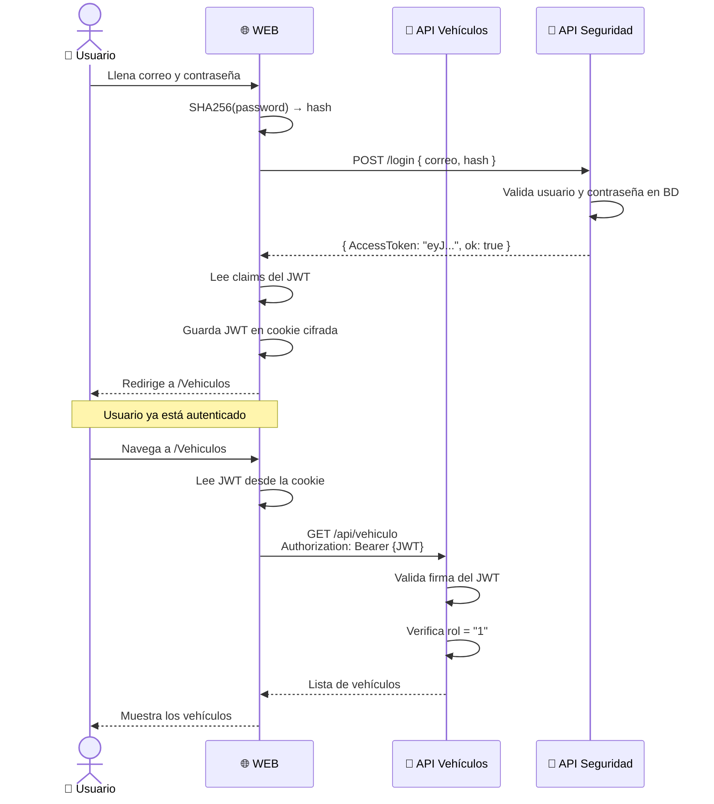

---

## 🔑 Concepto 1 — Hashing de Contraseñas (SHA256)

### ¿Por qué no guardar la contraseña directamente en la base de datos?

Esta es la pregunta más importante. La respuesta corta: **la base de datos siempre puede ser robada**. La diferencia entre un sistema seguro y uno inseguro está en qué tan útil es ese robo para el atacante.

---

#### ❌ Escenario inseguro — contraseñas en texto claro

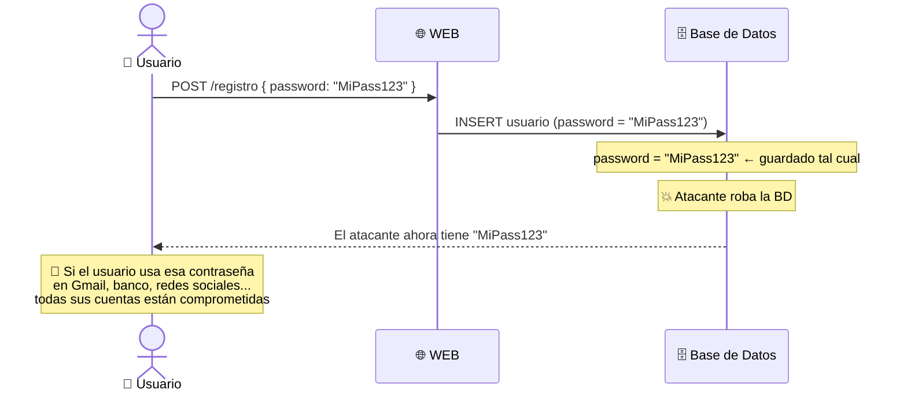

Con contraseñas en texto claro:
- Un empleado deshonesto puede ver tus contraseñas
- Si hackean la BD, obtienen **todas las contraseñas de todos los usuarios**
- El usuario que repite contraseñas en varios servicios pierde **todas** sus cuentas

---

#### ✅ Escenario seguro — contraseñas hasheadas

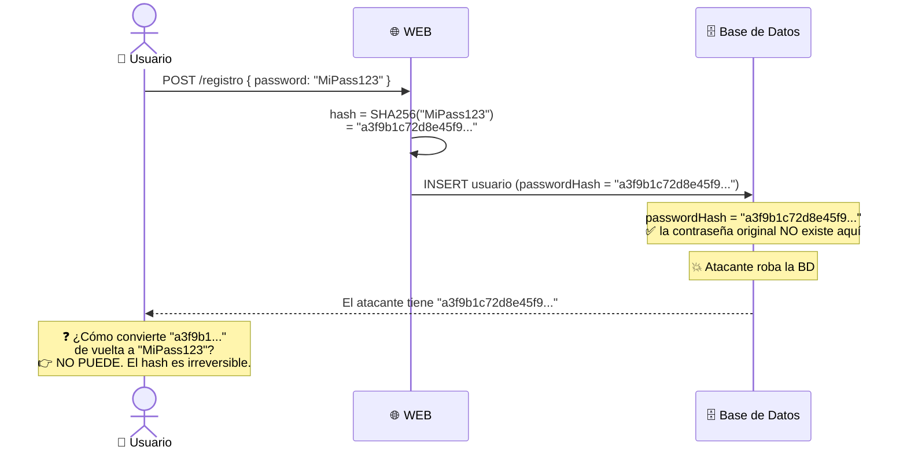

Con hashing el atacante obtiene una cadena de texto inútil que **no puede revertir**.

---

### ¿Qué pasa durante el Login?

El truco está en que no necesitamos "deshacer" el hash. Simplemente **repetimos la operación** y comparamos:

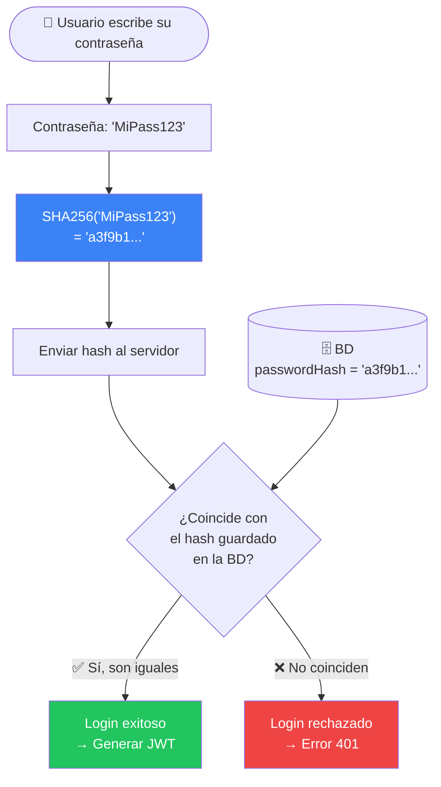

> La contraseña **nunca se almacena** en el servidor. Solo se almacena su hash irreversible.

---

### Propiedades clave del hash SHA256

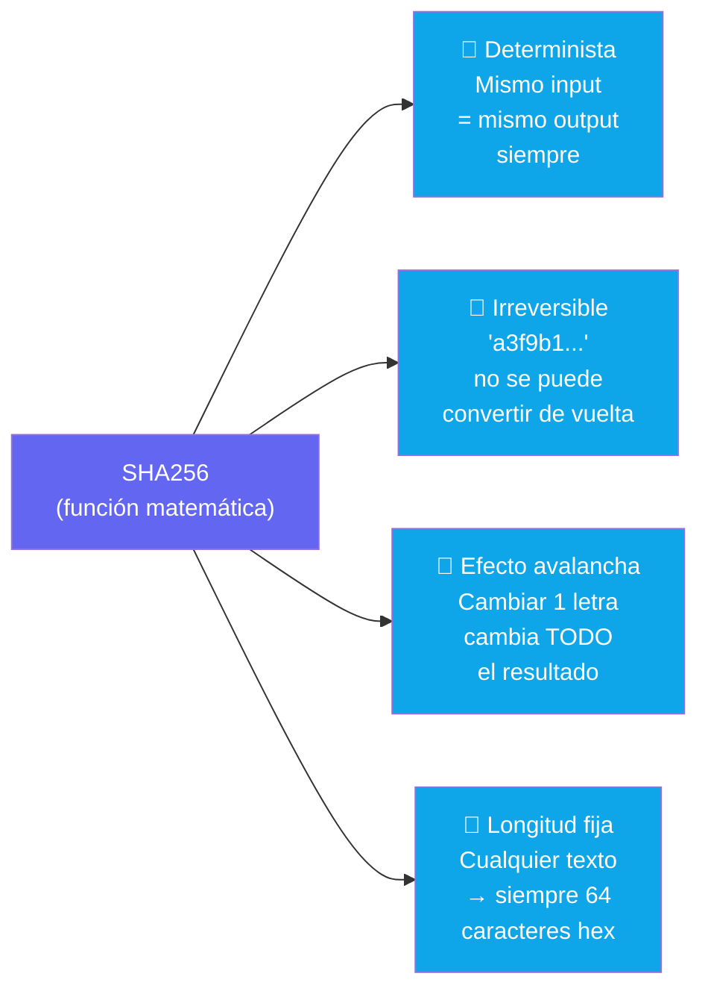

**Ejemplos del efecto avalancha:**
```
SHA256("MiContraseña123") = "a3f9b1c72d...8e45f9"
SHA256("MiContraseña124") = "b7d2a8c91e...3a12b4"  ← completamente distinto
SHA256("micontraseña123") = "f4c7e2a81b...9d23c5"  ← solo cambia mayúscula
```

---

### ¿Por qué SHA256 y no cifrado (AES, RSA)?

Esta distinción es fundamental para entender la decisión de diseño:

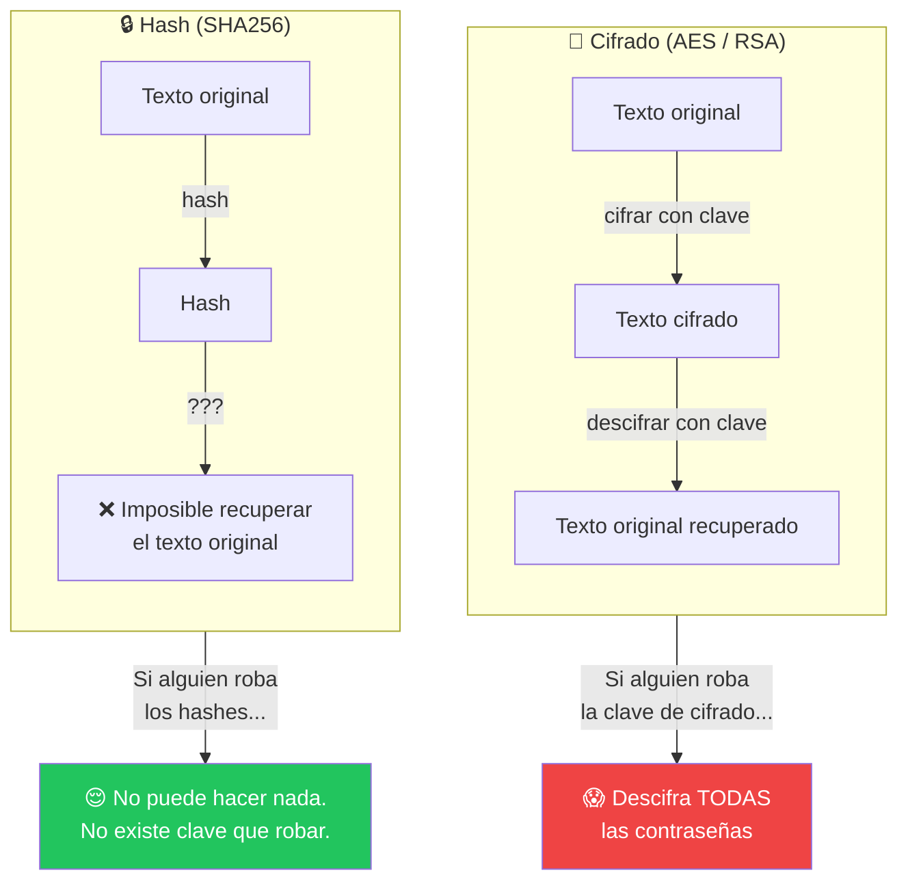

El cifrado es reversible con una clave. Si esa clave se compromete, todas las contraseñas se exponen. Un hash no tiene clave — es simplemente irreversible por diseño matemático.

---

### El código en C#

```csharp
// En Reglas/Autenticacion.cs

public static byte[] GenerarHash(string contrasenia)
{
    using (SHA256 shaHash = SHA256.Create())
    {
        // Convierte el texto a bytes UTF-8, luego aplica SHA256
        byte[] bytes = shaHash.ComputeHash(Encoding.UTF8.GetBytes(contrasenia));
        return bytes;  // Array de 32 bytes (256 bits)
    }
}

public static string ObtenerHash(byte[] hash)
{
    // Convierte el array de bytes a texto hexadecimal legible
    // Ej: [163, 249, 177, ...] → "a3f9b1..."
    StringBuilder builder = new StringBuilder();
    for (int i = 0; i < hash.Length; i++)
        builder.Append(hash[i].ToString("x2"));  // "x2" = hex con 2 dígitos
    return builder.ToString();
}
```

### ¿Cómo se usa en el Login?

```csharp
// En Login.cshtml.cs — OnPost()

// 1. El usuario escribió: "MiContraseña123"
var Hash = Autenticacion.GenerarHash(loginInfo.Password);
// Hash es ahora: byte[] { 163, 249, 177, ... }

loginInfo.PasswordHash = Autenticacion.ObtenerHash(Hash);
// PasswordHash es ahora: "a3f9b1c72d...8e45f9"

// 2. Enviamos el hash al API, NUNCA la contraseña original
await client.PostAsJsonAsync(endpoint, new LoginBase {
    CorreoElectronico = loginInfo.CorreoElectronico,
    PasswordHash      = loginInfo.PasswordHash,  // ✅ solo el hash
    // Password no se envía                       // ✅ contraseña NO incluida
});
```

En la base de datos también se guarda el hash, no la contraseña. Al hacer login, el API recalcula el hash y lo compara con lo que está guardado.

---

## 🎫 Concepto 2 — JWT (JSON Web Token)

### ¿Qué es un JWT?

Un JWT es un **token de seguridad** que el servidor crea y firma. Es como un carnet de identidad digital:
- El servidor lo emite después de verificar las credenciales
- El cliente lo presenta en cada petición
- El servidor puede verificar su autenticidad sin consultar una base de datos

### Estructura de un JWT

Un JWT tiene exactamente **3 partes** separadas por puntos:

```
eyJhbGciOiJIUzI1NiIsInR5cCI6IkpXVCJ9
.
eyJzdWIiOiIxMjM0NTY3ODkwIiwibmFtZSI6Ikp1YW4gUGVyZXoiLCJyb2wiOiIxIiwiaWF0IjoxNzA5NDAwMDAwfQ
.
SflKxwRJSMeKKF2QT4fwpMeJf36POk6yJV_adQssw5c
```

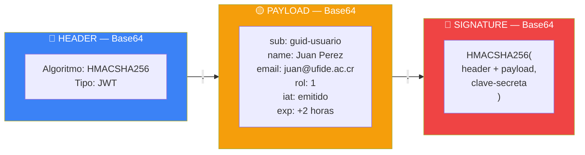

> 🔓 `HEADER` y `PAYLOAD` son solo **Base64** — cualquiera puede leerlos.
> 🔒 La `SIGNATURE` garantiza que nadie los modificó. Solo el servidor con la clave secreta puede crear firmas válidas.

> 🔓 El Header y el Payload son **Base64 — no cifrado**. Cualquiera puede leerlos.
> 🔒 La Signature garantiza que nadie los modificó. Solo el servidor con la clave secreta puede crear firmas válidas.

### Los Claims — la información dentro del token

Los **claims** son los datos que viajan dentro del JWT. En nuestro sistema:

| Claim | Tipo | Valor ejemplo | Uso |
|-------|------|--------------|-----|
| `name` | `ClaimTypes.Name` | `"juan"` | Mostrar nombre en la UI |
| `nameid` | `ClaimTypes.NameIdentifier` | `"guid-del-usuario"` | Identificador único |
| `email` | `ClaimTypes.Email` | `"juan@ufide.ac.cr"` | Correo institucional |
| `role` | `ClaimTypes.Role` | `"1"` | Control de acceso |
| `Token` | custom | `"eyJ..."` | El JWT completo guardado en la cookie |

### ¿Cómo se genera el JWT en el servidor?

Esto ocurre dentro del **API de Seguridad** (`Ejemplos/Seguridad/Seguridad.API`):

```csharp
// Simplificación del proceso de generación del token:

var tokenHandler = new JwtSecurityTokenHandler();
var key = Encoding.UTF8.GetBytes("Textoparagenerarelotkenjwtdelapi");

var tokenDescriptor = new SecurityTokenDescriptor
{
    Subject = new ClaimsIdentity(new[]
    {
        new Claim(ClaimTypes.Name,           usuario.NombreUsuario),
        new Claim(ClaimTypes.NameIdentifier, usuario.Id.ToString()),
        new Claim(ClaimTypes.Email,          usuario.CorreoElectronico),
        new Claim(ClaimTypes.Role,           usuario.IdRol.ToString()),
    }),
    Expires    = DateTime.UtcNow.AddMinutes(120),       // Vence en 2 horas
    Issuer     = "localhost",                            // Quién lo emitió
    Audience   = "localhost",                            // Para quién es
    SigningCredentials = new SigningCredentials(
        new SymmetricSecurityKey(key),
        SecurityAlgorithms.HmacSha256Signature
    )
};

SecurityToken token = tokenHandler.CreateToken(tokenDescriptor);
string tokenString  = tokenHandler.WriteToken(token);  // "eyJ..."
```

### ¿Cómo se valida el JWT en la API de Vehículos?

Cuando llega una petición con `Authorization: Bearer eyJ...`, ASP.NET Core automáticamente:

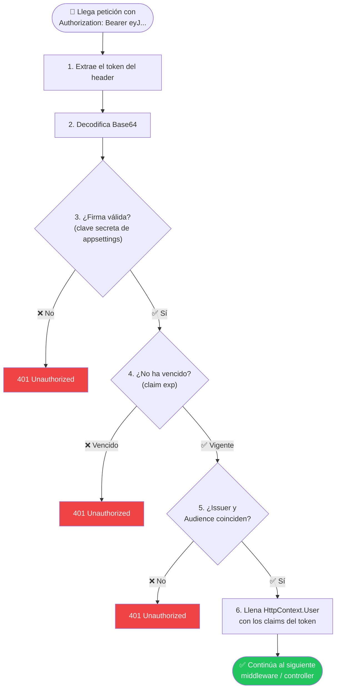

Esto lo configura este bloque en `Program.cs`:

```csharp
builder.Services.AddAuthentication(JwtBearerDefaults.AuthenticationScheme)
    .AddJwtBearer(options => {
        options.TokenValidationParameters = new TokenValidationParameters
        {
            ValidateIssuer           = true,   // ¿El Issuer coincide?
            ValidateAudience         = true,   // ¿El Audience coincide?
            ValidateLifetime         = true,   // ¿No venció?
            ValidateIssuerSigningKey = true,   // ¿La firma es válida?
            ValidIssuer              = jwtIssuer,
            ValidAudience            = jwtAudience,
            IssuerSigningKey         = new SymmetricSecurityKey(
                                           Encoding.UTF8.GetBytes(jwtKey))
        };
    });
```

---

## 🍪 Concepto 3 — Cookie de Autenticación en la WEB

### ¿Por qué la WEB usa cookies y no JWT directamente?

La WEB Razor Pages es una aplicación web tradicional. Los navegadores saben manejar cookies automáticamente — las envían en cada request sin que el código deba hacer nada especial.

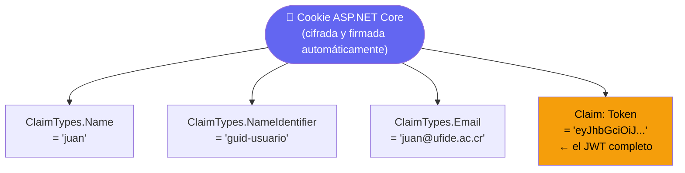

> ASP.NET Core **cifra y firma** estos datos automáticamente. El usuario del navegador no puede leer ni modificar el contenido de la cookie.

### El flujo de login en la WEB paso a paso

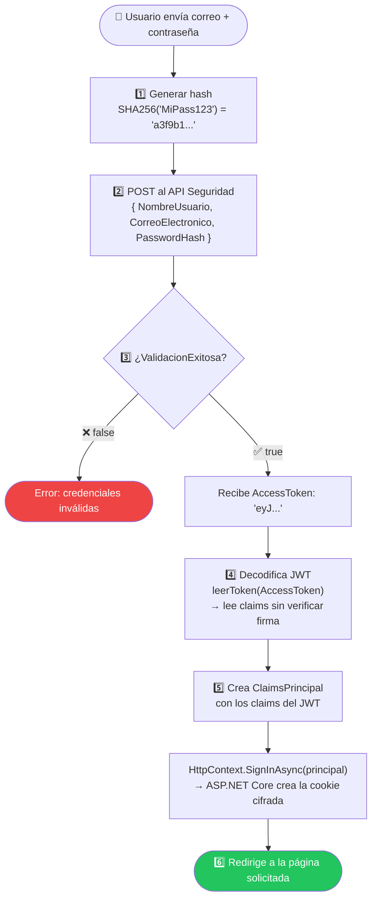

### ¿Cómo acceden las páginas al token JWT guardado en la cookie?

```csharp
// En cualquier página .cshtml.cs protegida:

var cliente = new HttpClient();
cliente.DefaultRequestHeaders.Authorization =
    new System.Net.Http.Headers.AuthenticationHeaderValue(
        "Bearer",
        HttpContext.User.Claims             // Lee los claims de la cookie
            .Where(c => c.Type == "Token") // Busca el claim llamado "Token"
            .FirstOrDefault().Value        // Obtiene el JWT string
    );
```

El flujo es:

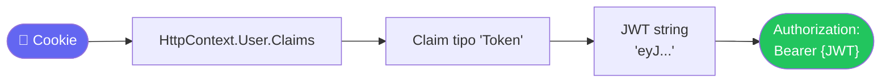

---

## 🧩 Concepto 4 — Middleware: `AutorizacionClaims()`

### ¿Qué es un Middleware?

El middleware en ASP.NET Core es código que se ejecuta **para toda petición HTTP**, en el orden en que fue registrado. Es como una cadena de filtros:

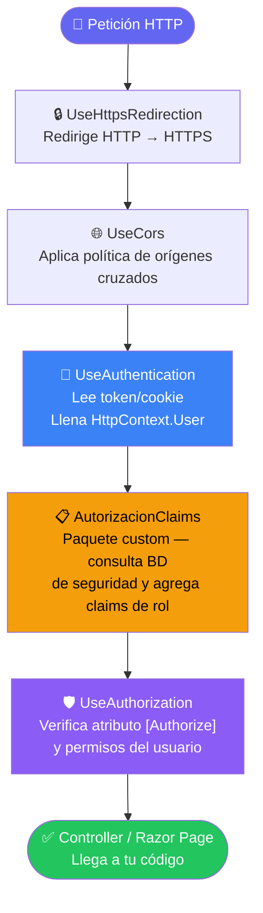

### ¿Qué hace específicamente `AutorizacionClaims()`?

Este middleware es el paquete `Autorizacion.Middleware`. Su trabajo es consultar la base de datos de seguridad para enriquecer los claims del usuario con información adicional (como el nombre del rol, permisos específicos, etc.).

```csharp
// Se agrega como Extension Method en Program.cs:
app.AutorizacionClaims();

// Internamente hace algo similar a esto:
public static void AutorizacionClaims(this IApplicationBuilder app)
{
    app.Use(async (context, next) =>
    {
        if (context.User.Identity.IsAuthenticated)
        {
            // Consulta la BD de seguridad con el userId del token
            // y agrega claims de roles/permisos al usuario actual
            var userId = context.User.FindFirst(ClaimTypes.NameIdentifier)?.Value;
            // ... consulta y agrega claims ...
        }
        await next(context);  // Continúa con el siguiente middleware
    });
}
```

### ¿Por qué el orden del middleware importa?

```csharp
// ✅ CORRECTO
app.UseAuthentication();  // Primero: identifica quién es el usuario
app.AutorizacionClaims(); // Segundo: agrega info de la BD (necesita saber quién es)
app.UseAuthorization();   // Tercero: verifica si puede acceder (necesita la info completa)

// ❌ INCORRECTO — AutorizacionClaims no sabe quién es el usuario aún
app.AutorizacionClaims();
app.UseAuthentication();
app.UseAuthorization();
```

---

## 🔒 Concepto 5 — Autorización basada en Roles

### `[Authorize]` vs `[Authorize(Roles = "1")]`

```csharp
// Solo verifica que el usuario esté autenticado (tiene sesión)
[Authorize]
public class VehiculoController : ControllerBase { }

// Además verifica que el usuario tiene el rol con Id = 1
[Authorize(Roles = "1")]
public async Task<IActionResult> Agregar([FromBody] VehiculoRequest v) { }
```

### ¿Cómo funciona la verificación de roles?

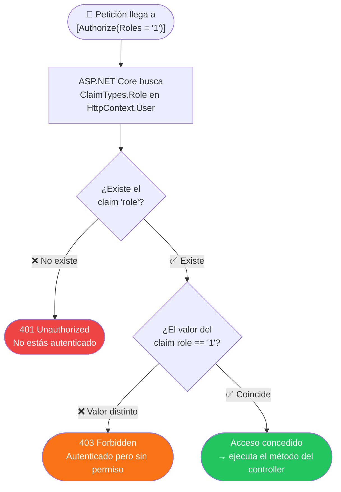

### Diferencia entre 401 y 403

| Código | Nombre | Significa |
|--------|--------|-----------|
| `401` | Unauthorized | No estás autenticado (sin token o token inválido) |
| `403` | Forbidden | Estás autenticado pero no tienes permiso para este recurso |

---

## 📦 Concepto 6 — Los Paquetes NuGet del Curso

El curso usa paquetes custom publicados en GitHub Packages:

| Paquete | Responsabilidad |
|---------|----------------|
| `Autorizacion.Abstracciones` | Interfaces: `IAutorizacionFlujo`, `ISeguridadDA` |
| `Autorizacion.DA` | Acceso a datos: consultas a la BD de seguridad |
| `Autorizacion.Flujo` | Lógica: valida credenciales, genera tokens |
| `Autorizacion.Middleware` | Extension method `app.AutorizacionClaims()` |

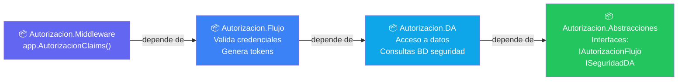

Los cuatro paquetes se instalan al mismo tiempo con la misma versión `2.0.6`.

---

## 🏗️ Concepto 7 — Arquitectura completa del sistema de seguridad

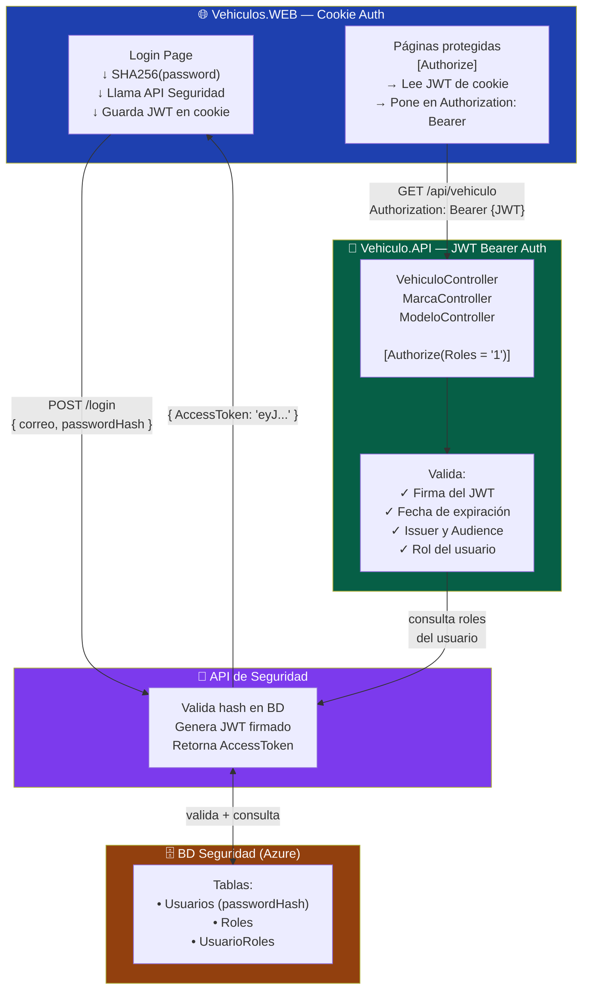

---

## 💡 Resumen — cinco ideas para recordar

| Concepto | En una línea |
|----------|-------------|
| **Hash SHA256** | Transforma la contraseña en texto irreversible — nunca se envía la contraseña real |
| **JWT** | Carnet digital firmado por el servidor — cualquiera puede leer los datos, nadie puede falsificarlos |
| **Claims** | Los datos del usuario que viajan dentro del JWT — nombre, email, rol |
| **Cookie** | La WEB guarda el JWT cifrado en una cookie para no pedirlo en cada página |
| **Middleware** | Filtro que se ejecuta en cada petición — verifica autenticidad antes de llegar al controller |

---

## 🔗 Referencias del código fuente en este repositorio

| Concepto | Archivo |
|----------|---------|
| Generación del hash | `Semana 06.../Vehiculos.WEB/Reglas/Autenticacion.cs` |
| Configuración JWT en la API | `Semana 06.../Vehiculo.API/API/Program.cs` |
| Cookie auth en la WEB | `Semana 06.../Vehiculos.WEB/Web/Program.cs` |
| Flujo del login | `Semana 06.../Vehiculos.WEB/Web/Pages/Cuenta/Login.cshtml.cs` |
| Autorización en controllers | `Semana 06.../Vehiculo.API/API/Controllers/VehiculoController.cs` |
| Modelos de seguridad | `Semana 06.../Vehiculos.WEB/Abstracciones/Modelos/Seguridad/` |

---

*Documento creado para SC701 — Semana 06 | Referencia: `CodigoBase/Semana 06-API y WEB con Seguridad`*
