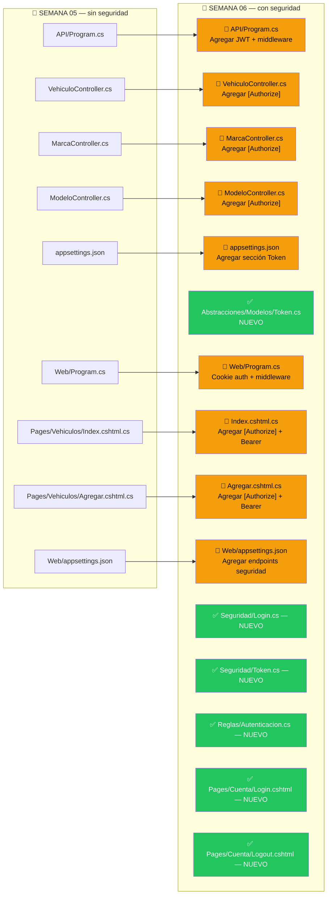
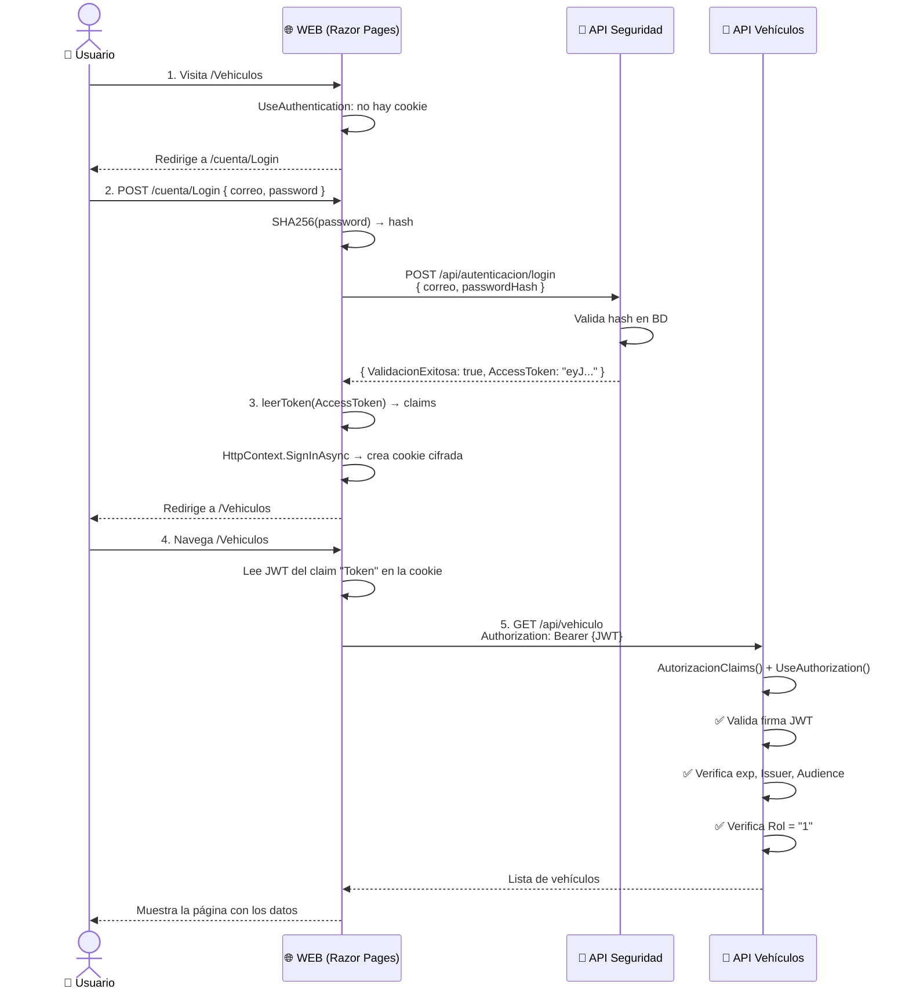
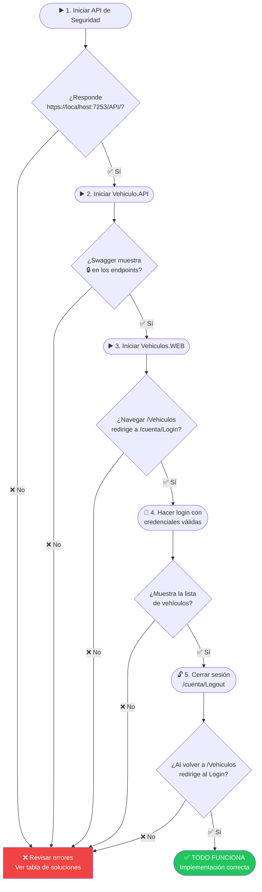

# 🔐 Guía de Migración: De API + WEB sin seguridad → con seguridad

> **Para quién es esta guía:** Estudiantes que ya tienen el código de la Semana 05
> funcionando y quieren agregar autenticación y autorización (Semana 06).
>
> **Código de referencia:**
> - 📂 Sin seguridad: `CodigoBase/Semana 05-API y WEB`
> - 📂 Con seguridad: `CodigoBase/Semana 06-API y WEB con Seguridad`
> - 📂 Paquetes de autorización: `CodigoBase/Ejemplos/Seguridad`

---

## 📊 ¿Qué va a cambiar?



> 🟡 **Modificar** archivos existentes &nbsp;|&nbsp; 🟢 **Crear** archivos nuevos

---

## 🗺️ Vista del flujo completo que vamos a construir



---

## ✅ Prerequisitos antes de empezar

Antes de tocar una sola línea de código, verifica estas 3 cosas:

### 1. El API de Seguridad está corriendo

El proyecto de seguridad está en:
```
CodigoBase/Ejemplos/Seguridad/Seguridad.API
```

Iniciarlo y verificar que responde:
```
https://localhost:7253/API/
```

> 💡 También hay una versión publicada disponible. Revisa el `appsettings.json` de referencia en `Semana 06`.

---

### 2. La base de datos de seguridad tiene roles

```sql
-- Ejecutar en SQL Server Management Studio
SELECT * FROM Roles;

-- Debes ver algo así:
-- Id | Nombre
-- 1  | Administrador
```

Si la tabla está vacía, la autorización fallará con error 403.

---

### 3. Configurar el feed de NuGet para los paquetes de Autorización

Los paquetes de seguridad no están en nuget.org. Están en un feed privado de GitHub.

**Crear (o editar) el archivo `NuGet.Config` en la raíz de cada solución:**

```xml
<?xml version="1.0" encoding="utf-8"?>
<configuration>
  <packageSources>
    <add key="nuget.org" value="https://api.nuget.org/v3/index.json" protocolVersion="3" />
    <add key="Paquetes" value="https://nuget.pkg.github.com/Drojascode/index.json" />
  </packageSources>
  <packageSourceCredentials>
    <Paquetes>
      <add key="Username" value="Drojascode" />
      <add key="ClearTextPassword" value="REMOVED_SECRET" />
    </Paquetes>
  </packageSourceCredentials>
</configuration>
```

---

## 🔧 PARTE 1 — Cambios en el proyecto API

### Paso 1 — Instalar paquetes NuGet

Editar `API/API.csproj` y agregar dentro del `<ItemGroup>`:

```xml
<PackageReference Include="Autorizacion.Abstracciones" Version="2.0.6" />
<PackageReference Include="Autorizacion.DA"            Version="2.0.6" />
<PackageReference Include="Autorizacion.Flujo"         Version="2.0.6" />
<PackageReference Include="Autorizacion.Middleware"    Version="2.0.6" />
<PackageReference Include="Microsoft.AspNetCore.Authentication.JwtBearer" Version="8.0.8" />
```

Luego ejecutar en la terminal:
```bash
dotnet restore
```

---

### Paso 2 — Crear el modelo `Token.cs`

**Archivo nuevo:** `Abstracciones/Modelos/Token.cs`

```csharp
using System.ComponentModel.DataAnnotations;

namespace Abstracciones.Modelos
{
    // Respuesta que devuelve el API de seguridad al hacer login
    public class Token
    {
        public bool ValidacionExitosa { get; set; }
        public string AccessToken { get; set; }
    }

    // Configuración que se lee de appsettings.json
    public class TokenConfiguracion
    {
        [Required]
        [StringLength(100, MinimumLength = 32)]
        public string key { get; set; }     // Clave secreta para firmar tokens

        [Required]
        public string Issuer { get; set; }  // Quién emite el token

        [Required]
        public double Expires { get; set; } // Minutos de vigencia

        public string Audience { get; set; } // Para quién es válido el token
    }
}
```

---

### Paso 3 — Actualizar `appsettings.json` del API

Abrir `API/appsettings.json` y agregar dos cosas:

```json
{
  "ConnectionStrings": {
    "BDSeguridad": "Data Source=tcp:sc701.database.windows.net;Initial Catalog=seguridad;User ID=administrador;Password=TuPassword;Encrypt=True",
    "BD": "Data Source=localhost;Initial Catalog=Vehiculos;Integrated Security=True;Encrypt=False"
  },
  "Token": {
    "key": "Textoparagenerarelotkenjwtdelapi",
    "Issuer": "localhost",
    "Audience": "localhost",
    "Expires": "120"
  }
}
```

> ⚠️ La `key` debe tener **mínimo 32 caracteres**. Es la clave secreta para firmar los tokens.

---

### Paso 4 — Modificar `Program.cs` del API

Este es el cambio más importante. Comparemos las dos versiones:

#### Semana 05 — Program.cs (SIN seguridad)
```csharp
using Abstracciones.Interfaces.DA;
// ... otros usings ...

var builder = WebApplication.CreateBuilder(args);

builder.Services.AddControllers();
builder.Services.AddEndpointsApiExplorer();
builder.Services.AddSwaggerGen();
builder.Services.AddHttpClient();

builder.Services.AddScoped<IVehiculoFlujo, VehiculoFlujo>();
// ... más servicios ...

var app = builder.Build();

if (app.Environment.IsDevelopment())
{
    app.UseSwagger();
    app.UseSwaggerUI();
}

app.UseHttpsRedirection();
app.UseCors(politicaAcceso);
app.UseAuthorization();     // ← estaba pero no hacía nada sin configurar
app.MapControllers();
app.Run();
```

#### Semana 06 — Program.cs (CON seguridad) — diferencias marcadas con ★

```csharp
using Abstracciones.Interfaces.DA;
// ... otros usings ...
using Abstracciones.Modelos;                          // ★ NUEVO
using Microsoft.AspNetCore.Authentication.JwtBearer;  // ★ NUEVO
using Microsoft.IdentityModel.Tokens;                 // ★ NUEVO
using System.Text;                                    // ★ NUEVO
using Autorizacion.Middleware;                        // ★ NUEVO

var builder = WebApplication.CreateBuilder(args);

// ★ NUEVO BLOQUE — Leer configuración JWT y registrar autenticación
var tokenConfiguration = builder.Configuration.GetSection("Token").Get<TokenConfiguracion>();
var jwtIssuer    = tokenConfiguration.Issuer;
var jwtAudience  = tokenConfiguration.Audience;
var jwtKey       = tokenConfiguration.key;

builder.Services.AddAuthentication(JwtBearerDefaults.AuthenticationScheme)
    .AddJwtBearer(options => {
        options.TokenValidationParameters = new TokenValidationParameters
        {
            ValidateIssuer           = true,
            ValidateAudience         = true,
            ValidateLifetime         = true,
            ValidateIssuerSigningKey = true,
            ValidIssuer              = jwtIssuer,
            ValidAudience            = jwtAudience,
            IssuerSigningKey         = new SymmetricSecurityKey(Encoding.UTF8.GetBytes(jwtKey))
        };
    });
// ★ FIN NUEVO BLOQUE

builder.Services.AddControllers();
builder.Services.AddEndpointsApiExplorer();
builder.Services.AddSwaggerGen();
builder.Services.AddHttpClient();

builder.Services.AddScoped<IVehiculoFlujo, VehiculoFlujo>();
// ... más servicios exactamente igual ...

// ★ NUEVO — Registrar servicios del paquete de Autorización
builder.Services.AddTransient<Autorizacion.Abstracciones.Flujo.IAutorizacionFlujo,
                               Autorizacion.Flujo.AutorizacionFlujo>();
builder.Services.AddTransient<Autorizacion.Abstracciones.DA.ISeguridadDA,
                               Autorizacion.DA.SeguridadDA>();
builder.Services.AddTransient<Autorizacion.Abstracciones.DA.IRepositorioDapper,
                               Autorizacion.DA.Repositorios.RepositorioDapper>();

var app = builder.Build();

if (app.Environment.IsDevelopment())
{
    app.UseSwagger();
    app.UseSwaggerUI();
}

app.UseHttpsRedirection();
app.UseCors(politicaAcceso);

app.AutorizacionClaims();  // ★ NUEVO — middleware que inyecta los claims del token
app.UseAuthorization();

app.MapControllers();
app.Run();
```

> 🔑 **Nota clave sobre el orden:** `app.AutorizacionClaims()` debe ir **antes** de `app.UseAuthorization()`.

---

### Paso 5 — Proteger los Controllers con `[Authorize]`

#### Antes (Semana 05)
```csharp
[Route("api/[controller]")]
[ApiController]
public class VehiculoController : ControllerBase
{
    [HttpGet]
    public async Task<IActionResult> Obtener() { ... }

    [HttpPost]
    public async Task<IActionResult> Agregar(...) { ... }
}
```

#### Después (Semana 06)
```csharp
using Microsoft.AspNetCore.Authorization;  // ← AGREGAR

[Route("api/[controller]")]
[ApiController]
[Authorize]                                // ← AGREGAR en la clase
public class VehiculoController : ControllerBase
{
    [HttpGet]
    [Authorize(Roles = "1")]               // ← AGREGAR en cada método
    public async Task<IActionResult> Obtener() { ... }

    [HttpPost]
    [Authorize(Roles = "1")]               // ← AGREGAR en cada método
    public async Task<IActionResult> Agregar(...) { ... }

    [HttpPut("{Id}")]
    [Authorize(Roles = "1")]
    public async Task<IActionResult> Editar(...) { ... }

    [HttpDelete("{Id}")]
    [Authorize(Roles = "1")]
    public async Task<IActionResult> Eliminar(...) { ... }
}
```

Repetir para `MarcaController.cs` y `ModeloController.cs`.

> 📝 El número `"1"` es el **Id del Rol** en la base de datos de seguridad.

---

## 🌐 PARTE 2 — Cambios en el proyecto WEB

### Paso 1 — Instalar paquetes NuGet

Editar `Web/Web.csproj`:

```xml
<PackageReference Include="Autorizacion.Abstracciones" Version="2.0.6" />
<PackageReference Include="Autorizacion.DA"            Version="2.0.6" />
<PackageReference Include="Autorizacion.Flujo"         Version="2.0.6" />
<PackageReference Include="Autorizacion.Middleware"    Version="2.0.6" />
<PackageReference Include="System.IdentityModel.Tokens.Jwt" Version="8.1.2" />
```

```bash
dotnet restore
```

---

### Paso 2 — Reorganizar modelos (nueva estructura de carpetas)

La Semana 06 organiza los modelos en subcarpetas para separar conceptos:

```
Abstracciones/Modelos/
├── Vehiculos/          ← MOVER los modelos de vehículos aquí
│   ├── Vehiculo.cs    (actualizar namespace → Abstracciones.Modelos.Vehiculos)
│   ├── Marca.cs       (actualizar namespace → Abstracciones.Modelos.Vehiculos)
│   └── Modelo.cs      (actualizar namespace → Abstracciones.Modelos.Vehiculos)
└── Seguridad/          ← CREAR nueva carpeta
    ├── Login.cs        ← NUEVO
    └── Token.cs        ← NUEVO
```

**Crear `Abstracciones/Modelos/Seguridad/Login.cs`:**

```csharp
using System.ComponentModel.DataAnnotations;

namespace Abstracciones.Modelos.Seguridad
{
    // Campos base que se envían al API de seguridad
    public class LoginBase
    {
        public string? NombreUsuario { get; set; }
        public string? PasswordHash  { get; set; }

        [Required]
        [EmailAddress]
        public string CorreoElectronico { get; set; }
    }

    // Incluye el Id — usado en respuestas de la BD
    public class Login : LoginBase
    {
        [Required]
        public Guid Id { get; set; }
    }

    // Lo que llena el usuario en el formulario (incluye Password en texto claro)
    public class LoginRequest : LoginBase
    {
        [Required]
        public string Password { get; set; }  // Nunca se envía al API, solo se hashea
    }
}
```

**Crear `Abstracciones/Modelos/Seguridad/Token.cs`:**

```csharp
using System.ComponentModel.DataAnnotations;

namespace Abstracciones.Modelos.Seguridad
{
    // Respuesta del API de seguridad
    public class Token
    {
        public bool    ValidacionExitosa { get; set; }
        public string? AccessToken       { get; set; }
    }
}
```

---

### Paso 3 — Crear la clase `Autenticacion.cs` en el proyecto Reglas

**Archivo nuevo:** `Reglas/Autenticacion.cs`

```csharp
using System.IdentityModel.Tokens.Jwt;
using System.Security.Claims;
using System.Security.Cryptography;
using System.Text;

namespace Reglas
{
    public static class Autenticacion
    {
        // Genera los bytes del hash SHA256 de la contraseña
        public static byte[] GenerarHash(string contrasenia)
        {
            using (SHA256 shaHash = SHA256.Create())
            {
                return shaHash.ComputeHash(Encoding.UTF8.GetBytes(contrasenia));
            }
        }

        // Convierte los bytes a texto hexadecimal (ej: "a3f9b1...")
        public static string ObtenerHash(byte[] hash)
        {
            var builder = new StringBuilder();
            for (int i = 0; i < hash.Length; i++)
                builder.Append(hash[i].ToString("x2"));
            return builder.ToString();
        }

        // Decodifica un JWT string en un objeto JwtSecurityToken
        public static JwtSecurityToken? leerToken(string token)
        {
            var handler   = new JwtSecurityTokenHandler();
            return handler.ReadToken(token) as JwtSecurityToken;
        }

        // Extrae los claims del JWT y los convierte en claims de la cookie
        public static List<Claim> GenerarClaims(JwtSecurityToken? jwtToken, string accessToken)
        {
            var claims = new List<Claim>();
            claims.Add(new Claim(ClaimTypes.Name,
                jwtToken.Claims.First(c => c.Type == ClaimTypes.Name).Value));
            claims.Add(new Claim(ClaimTypes.NameIdentifier,
                jwtToken.Claims.First(c => c.Type == ClaimTypes.NameIdentifier).Value));
            claims.Add(new Claim(ClaimTypes.Email,
                jwtToken.Claims.First(c => c.Type == ClaimTypes.Email).Value));
            claims.Add(new Claim("Token", accessToken));  // Guardamos el JWT completo
            return claims;
        }
    }
}
```

---

### Paso 4 — Actualizar `appsettings.json` del WEB

```json
{
  "ConnectionStrings": {
    "BDSeguridad": "Data Source=localhost;Initial Catalog=Seguridad;Integrated Security=True;Encrypt=False"
  },
  "ApiEndPoints": {
    "UrlBase": "https://localhost:7001/api/",
    "Metodos": [
      { "Nombre": "ObtenerVehiculos", "Valor": "vehiculo" },
      { "Nombre": "AgregarVehiculo",  "Valor": "vehiculo" }
    ]
  },
  "ApiEndPointsSeguridad": {
    "UrlBase": "https://seguridadapi.azurewebsites.net/API/",
    "Metodos": [
      { "Nombre": "Login",    "Valor": "Autenticacion/login" },
      { "Nombre": "Registro", "Valor": "usuario/registrarusuario" }
    ]
  }
}
```

---

### Paso 5 — Modificar `Program.cs` del WEB

#### Semana 05 (SIN seguridad)
```csharp
var builder = WebApplication.CreateBuilder(args);

builder.Services.AddRazorPages();
builder.Services.AddScoped<IConfiguracion, Configuracion>();

var app = builder.Build();

app.UseHttpsRedirection();
app.UseStaticFiles();
app.UseRouting();
app.UseAuthorization();
app.MapRazorPages();
app.Run();
```

#### Semana 06 (CON seguridad) — diferencias marcadas con ★

```csharp
using Abstracciones.Interfaces.Reglas;
using Autorizacion.Abstracciones.DA;        // ★ NUEVO
using Autorizacion.Abstracciones.Flujo;     // ★ NUEVO
using Autorizacion.DA;                      // ★ NUEVO
using Autorizacion.DA.Repositorios;         // ★ NUEVO
using Autorizacion.Flujo;                   // ★ NUEVO
using Autorizacion.Middleware;              // ★ NUEVO
using Microsoft.AspNetCore.Authentication.Cookies; // ★ NUEVO
using Reglas;

var builder = WebApplication.CreateBuilder(args);

// ★ NUEVO — Autenticación con Cookie
builder.Services.AddAuthentication(CookieAuthenticationDefaults.AuthenticationScheme)
    .AddCookie(options =>
    {
        options.LoginPath       = "/cuenta/Login";
        options.LogoutPath      = "/cuenta/Logout";
        options.AccessDeniedPath = "/cuenta/Accesodenegado";
    });

// ★ NUEVO — Servicios del paquete de Autorización
builder.Services.AddTransient<IRepositorioDapper, RepositorioDapper>();
builder.Services.AddTransient<ISeguridadDA, SeguridadDA>();
builder.Services.AddTransient<IAutorizacionFlujo, AutorizacionFlujo>();

builder.Services.AddRazorPages();
builder.Services.AddScoped<IConfiguracion, Configuracion>();

var app = builder.Build();

app.UseHttpsRedirection();
app.UseStaticFiles();
app.UseRouting();

app.UseAuthentication();  // ★ NUEVO — debe ir antes de UseAuthorization
app.AutorizacionClaims(); // ★ NUEVO — middleware de claims
app.UseAuthorization();

app.MapRazorPages();
app.Run();
```

> 🔑 **Orden crítico del middleware:**
> ```
> UseAuthentication  →  AutorizacionClaims  →  UseAuthorization
> ```
> Si cambias este orden, la autenticación no funciona.

---

### Paso 6 — Crear las páginas de cuenta

Crear la carpeta `Web/Pages/Cuenta/` y agregar estas páginas:

#### `Login.cshtml` (formulario)

```html
@page
@model Web.Pages.Cuenta.LoginModel
@{ ViewData["Title"] = "Iniciar Sesión"; }

<h1>@ViewData["Title"]</h1>

<div class="row">
    <div class="col-md-4">
        <form method="post">
            <div asp-validation-summary="All" class="text-danger"></div>

            <div class="form-group mb-2">
                <label asp-for="loginInfo.CorreoElectronico">Correo electrónico</label>
                <input asp-for="loginInfo.CorreoElectronico" class="form-control" />
                <span asp-validation-for="loginInfo.CorreoElectronico" class="text-danger"></span>
            </div>

            <div class="form-group mb-3">
                <label asp-for="loginInfo.Password">Contraseña</label>
                <input asp-for="loginInfo.Password" class="form-control" type="password" />
                <span asp-validation-for="loginInfo.Password" class="text-danger"></span>
            </div>

            <button type="submit" class="btn btn-primary">Iniciar Sesión</button>
        </form>
    </div>
</div>
```

#### `Login.cshtml.cs` (lógica del login)

```csharp
using Abstracciones.Interfaces.Reglas;
using Abstracciones.Modelos.Seguridad;
using Microsoft.AspNetCore.Authentication;
using Microsoft.AspNetCore.Authentication.Cookies;
using Microsoft.AspNetCore.Mvc;
using Microsoft.AspNetCore.Mvc.RazorPages;
using Reglas;
using System.IdentityModel.Tokens.Jwt;
using System.Security.Claims;
using System.Text.Json;

namespace Web.Pages.Cuenta
{
    public class LoginModel : PageModel
    {
        [BindProperty] public LoginRequest loginInfo { get; set; } = default!;
        [BindProperty] public Token token { get; set; } = default!;

        private readonly IConfiguracion _configuracion;

        public LoginModel(IConfiguracion configuracion)
        {
            _configuracion = configuracion;
        }

        public async Task<IActionResult> OnPost()
        {
            if (ModelState.IsValid)
            {
                // 1. Hashear la contraseña — NUNCA enviar en texto claro
                var Hash = Autenticacion.GenerarHash(loginInfo.Password);
                loginInfo.PasswordHash    = Autenticacion.ObtenerHash(Hash);
                loginInfo.NombreUsuario   = loginInfo.CorreoElectronico.Split("@")[0];

                // 2. Llamar al API de seguridad
                string endpoint = _configuracion.ObtenerMetodo("ApiEndPointsSeguridad", "Login");
                var client = new HttpClient();
                var respuesta = await client.PostAsJsonAsync<LoginBase>(endpoint, new LoginBase
                {
                    NombreUsuario     = loginInfo.NombreUsuario,
                    CorreoElectronico = loginInfo.CorreoElectronico,
                    PasswordHash      = loginInfo.PasswordHash
                });
                respuesta.EnsureSuccessStatusCode();

                // 3. Deserializar el token JWT recibido
                var opciones = new JsonSerializerOptions { PropertyNameCaseInsensitive = true };
                token = JsonSerializer.Deserialize<Token>(
                            respuesta.Content.ReadAsStringAsync().Result, opciones);

                if (token.ValidacionExitosa)
                {
                    // 4. Leer los claims del JWT y crear la cookie de sesión
                    JwtSecurityToken? jwtToken = Autenticacion.leerToken(token.AccessToken);
                    var claims = Autenticacion.GenerarClaims(jwtToken, token.AccessToken);
                    await establecerAutenticacion(claims);

                    // 5. Redirigir a la página original o al inicio
                    var urlredirigir = $"{HttpContext.Request.Query["ReturnUrl"]}";
                    if (string.IsNullOrEmpty(urlredirigir))
                        return Redirect("/");
                    return Redirect(urlredirigir);
                }
            }
            return Page();
        }

        private async Task establecerAutenticacion(List<Claim> claims)
        {
            var identity  = new ClaimsIdentity(claims, CookieAuthenticationDefaults.AuthenticationScheme);
            var principal = new ClaimsPrincipal(identity);
            await HttpContext.SignInAsync(principal);
        }
    }
}
```

#### `Logout.cshtml.cs`

```csharp
using Microsoft.AspNetCore.Authentication;
using Microsoft.AspNetCore.Mvc;
using Microsoft.AspNetCore.Mvc.RazorPages;

namespace Web.Pages.Cuenta
{
    public class LogoutModel : PageModel
    {
        public async Task<IActionResult> OnGet()
        {
            await HttpContext.SignOutAsync();
            return RedirectToPage("/Index");
        }
    }
}
```

---

### Paso 7 — Proteger las páginas de vehículos

En **cada** archivo `.cshtml.cs` de la carpeta `Pages/Vehiculos/`, aplicar estos cambios:

#### Cambio 1 — Agregar usings
```csharp
using Microsoft.AspNetCore.Authorization;
using Abstracciones.Modelos.Vehiculos;  // ← cambiar de Abstracciones.Modelos
```

#### Cambio 2 — Proteger la clase
```csharp
[Authorize(Roles = "1")]   // ← AGREGAR
public class IndexModel : PageModel
```

#### Cambio 3 — Enviar el token en cada llamada HTTP

Buscar cada `new HttpClient()` y agregar el header Bearer:

```csharp
// ANTES
var cliente = new HttpClient();
var solicitud = new HttpRequestMessage(HttpMethod.Get, endpoint);

// DESPUÉS
var cliente = new HttpClient();
cliente.DefaultRequestHeaders.Authorization =
    new System.Net.Http.Headers.AuthenticationHeaderValue(
        "Bearer",
        HttpContext.User.Claims
            .Where(c => c.Type == "Token")
            .FirstOrDefault().Value
    );
var solicitud = new HttpRequestMessage(HttpMethod.Get, endpoint);
```

---

## 🚦 Verificación paso a paso

Una vez que tienes todo implementado, sigue este orden de pruebas:



---

## ❌ Errores frecuentes y soluciones

| Síntoma | Causa probable | Solución |
|---------|---------------|----------|
| `401 Unauthorized` al llamar la API desde Swagger | No se envió el token en la petición | En Swagger: clic en 🔓, pegar el `AccessToken` |
| `401 Unauthorized` al navegar en la WEB | El token no se está pasando en el header | Verificar que el `[Authorize]` está en la clase y que el header `Bearer` se agrega correctamente |
| `403 Forbidden` | Usuario no tiene el rol "1" en la BD | Ejecutar `SELECT * FROM Roles` y verificar que existe el rol con Id = 1 |
| No redirige a Login | Falta `UseAuthentication()` en Program.cs | Agregar y verificar el orden del middleware |
| `NullReferenceException` en el claim Token | La cookie no contiene el claim "Token" | Verificar que `GenerarClaims` incluye `new Claim("Token", accessToken)` |
| Paquete NuGet no encontrado | No está configurado el feed de NuGet | Verificar `NuGet.Config` en la raíz de la solución |

---

## 📂 Resultado final — estructura de archivos

```
Vehiculo.API/
  API/
    Program.cs             ✅ Configuración JWT + middleware
    appsettings.json       ✅ Sección "Token" agregada
    Controllers/
      VehiculoController.cs  ✅ [Authorize] + [Authorize(Roles = "1")]
      MarcaController.cs     ✅ [Authorize(Roles = "1")]
      ModeloController.cs    ✅ [Authorize(Roles = "1")]
  Abstracciones/
    Modelos/
      Token.cs             ✅ Nuevo
  NuGet.Config             ✅ Feed de paquetes configurado

Vehiculos.WEB/
  Web/
    Program.cs             ✅ Cookie auth + AutorizacionClaims + orden correcto
    appsettings.json       ✅ Sección "ApiEndPointsSeguridad" agregada
    Pages/
      Cuenta/
        Login.cshtml       ✅ Nuevo
        Login.cshtml.cs    ✅ Nuevo
        Logout.cshtml      ✅ Nuevo
        Logout.cshtml.cs   ✅ Nuevo
      Vehiculos/
        Index.cshtml.cs    ✅ [Authorize] + header Bearer
        Agregar.cshtml.cs  ✅ [Authorize] + header Bearer
        Editar.cshtml.cs   ✅ [Authorize] + header Bearer
        Eliminar.cshtml.cs ✅ [Authorize] + header Bearer
  Abstracciones/
    Modelos/
      Seguridad/
        Login.cs           ✅ Nuevo
        Token.cs           ✅ Nuevo
      Vehiculos/
        Vehiculo.cs        ✅ Namespace actualizado
        Marca.cs           ✅ Namespace actualizado
        Modelo.cs          ✅ Namespace actualizado
  Reglas/
    Autenticacion.cs       ✅ Nuevo — hash + claims
  NuGet.Config             ✅ Feed de paquetes configurado
```

---

*Guía creada para SC701 — Semana 06 | Referencia: `CodigoBase/Semana 06-API y WEB con Seguridad`*
