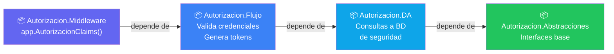
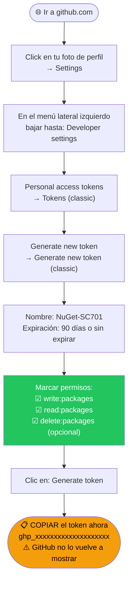
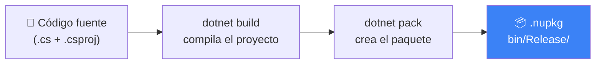
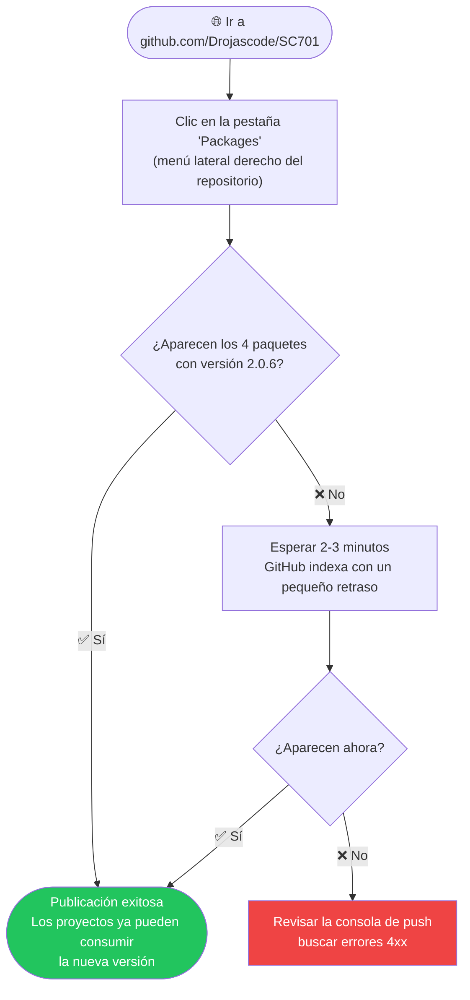
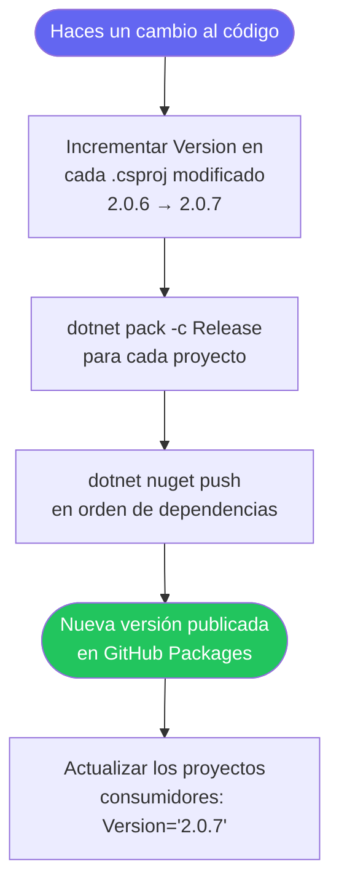
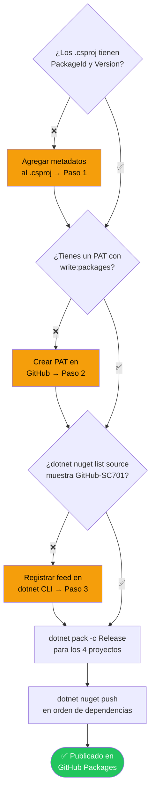

# 📦 Guía: Publicar los paquetes Autorizacion.* en GitHub Packages

> **Para quién es esta guía:** Quien mantiene o modifica el proyecto
> `CodigoBase/Ejemplos/Seguridad/Seguridad.MiddlewareAutorizacion` y necesita
> publicar una nueva versión para que los proyectos del curso puedan consumirla.
>
> **Resultado final:** Los 4 paquetes `Autorizacion.*` disponibles vía NuGet desde GitHub Packages.

---

## 🗺️ El proceso de un vistazo

```mermaid
flowchart LR
    A(["💻 Código fuente<br/>Seguridad.MiddlewareAutorizacion"])
    B["1️⃣ Configurar .csproj<br/>con metadatos de paquete"]
    C["2️⃣ Crear Personal Access Token<br/>en GitHub (PAT)"]
    D["3️⃣ Autenticar dotnet CLI<br/>con GitHub Packages"]
    E["4️⃣ dotnet pack<br/>Genera los .nupkg"]
    F["5️⃣ dotnet nuget push<br/>Sube a GitHub Packages"]
    G(["✅ Paquetes disponibles<br/>en github.com/Drojascode"])

    A --> B --> C --> D --> E --> F --> G

    style A fill:#6366f1,color:#fff
    style G fill:#22c55e,color:#fff
    style E fill:#3b82f6,color:#fff
    style F fill:#3b82f6,color:#fff
```



---

## 📂 Estructura del proyecto

```
CodigoBase/Ejemplos/Seguridad/Seguridad.MiddlewareAutorizacion/
├── Autorizacion.Abstracciones/   ← Interfaces base (sin dependencias entre proyectos)
├── Autorizacion.DA/              ← Acceso a datos       (depende de Abstracciones)
├── Autorizacion.Flujo/           ← Lógica de negocio    (depende de Abstracciones + DA)
└── Autorizacion.Middleware/      ← Extension method     (depende de los 3 anteriores)
```



> ⚠️ **El orden de publicación importa:** Abstracciones → DA → Flujo → Middleware

---

## ✅ Paso 1 — Configurar los `.csproj` con metadatos de paquete

Los archivos `.csproj` actuales solo tienen `<Version>`. Hay que agregar las propiedades
de paquete para que `dotnet pack` genere los metadatos correctos en NuGet.

### `Autorizacion.Abstracciones.csproj`

```xml
<Project Sdk="Microsoft.NET.Sdk">
  <PropertyGroup>
    <TargetFramework>net8.0</TargetFramework>
    <ImplicitUsings>enable</ImplicitUsings>
    <Nullable>enable</Nullable>

    <!-- Metadatos del paquete NuGet -->
    <PackageId>Autorizacion.Abstracciones</PackageId>
    <Version>2.0.6</Version>
    <Authors>Drojascode</Authors>
    <Company>SC701</Company>
    <Description>Interfaces base para el sistema de autorización SC701</Description>
    <RepositoryUrl>https://github.com/Drojascode/SC701</RepositoryUrl>
    <GeneratePackageOnBuild>false</GeneratePackageOnBuild>
  </PropertyGroup>

  <ItemGroup>
    <PackageReference Include="System.Data.SqlClient" Version="4.8.6" />
  </ItemGroup>
</Project>
```

### `Autorizacion.DA.csproj`

```xml
<Project Sdk="Microsoft.NET.Sdk">
  <PropertyGroup>
    <TargetFramework>net8.0</TargetFramework>
    <ImplicitUsings>enable</ImplicitUsings>
    <Nullable>enable</Nullable>

    <PackageId>Autorizacion.DA</PackageId>
    <Version>2.0.6</Version>
    <Authors>Drojascode</Authors>
    <Company>SC701</Company>
    <Description>Capa de acceso a datos para el sistema de autorización SC701</Description>
    <RepositoryUrl>https://github.com/Drojascode/SC701</RepositoryUrl>
    <GeneratePackageOnBuild>false</GeneratePackageOnBuild>
  </PropertyGroup>

  <ItemGroup>
    <ProjectReference Include="..\Autorizacion.Abstracciones\Autorizacion.Abstracciones.csproj" />
  </ItemGroup>
</Project>
```

### `Autorizacion.Flujo.csproj`

```xml
<Project Sdk="Microsoft.NET.Sdk">
  <PropertyGroup>
    <TargetFramework>net8.0</TargetFramework>
    <ImplicitUsings>enable</ImplicitUsings>
    <Nullable>enable</Nullable>

    <PackageId>Autorizacion.Flujo</PackageId>
    <Version>2.0.6</Version>
    <Authors>Drojascode</Authors>
    <Company>SC701</Company>
    <Description>Lógica de autorización y generación de tokens JWT para SC701</Description>
    <RepositoryUrl>https://github.com/Drojascode/SC701</RepositoryUrl>
    <GeneratePackageOnBuild>false</GeneratePackageOnBuild>
  </PropertyGroup>

  <ItemGroup>
    <ProjectReference Include="..\Autorizacion.Abstracciones\Autorizacion.Abstracciones.csproj" />
    <ProjectReference Include="..\Autorizacion.DA\Autorizacion.DA.csproj" />
  </ItemGroup>
</Project>
```

### `Autorizacion.Middleware.csproj`

```xml
<Project Sdk="Microsoft.NET.Sdk">
  <PropertyGroup>
    <TargetFramework>net8.0</TargetFramework>
    <ImplicitUsings>enable</ImplicitUsings>
    <Nullable>enable</Nullable>

    <PackageId>Autorizacion.Middleware</PackageId>
    <Version>2.0.6</Version>
    <Authors>Drojascode</Authors>
    <Company>SC701</Company>
    <Description>Middleware AutorizacionClaims() para ASP.NET Core — SC701</Description>
    <RepositoryUrl>https://github.com/Drojascode/SC701</RepositoryUrl>
    <GeneratePackageOnBuild>false</GeneratePackageOnBuild>
  </PropertyGroup>

  <ItemGroup>
    <PackageReference Include="Microsoft.AspNetCore.Http.Abstractions" Version="2.1.1" />
    <PackageReference Include="Microsoft.Extensions.Configuration.Abstractions" Version="2.1.1" />
  </ItemGroup>

  <ItemGroup>
    <ProjectReference Include="..\Autorizacion.Abstracciones\Autorizacion.Abstracciones.csproj" />
  </ItemGroup>
</Project>
```

> 💡 **¿Cuándo cambiar `<Version>`?**
>
> | Cambio | Ejemplo | Cuándo usarlo |
> |--------|---------|---------------|
> | Parche | `2.0.5 → 2.0.6` | Corrección de bug, sin cambios de API |
> | Minor  | `2.0.6 → 2.1.0` | Nueva funcionalidad compatible con versiones anteriores |
> | Major  | `2.1.0 → 3.0.0` | Cambio que rompe la compatibilidad |

---

## 🔑 Paso 2 — Crear un Personal Access Token (PAT) en GitHub

GitHub Packages requiere autenticación para publicar. Los tokens se crean así:



---

## 🔐 Paso 3 — Registrar el feed de GitHub en dotnet CLI

Ejecutar esto **una sola vez por computadora** desde cualquier terminal:

```bash
dotnet nuget add source `
  --username Drojascode `
  --password ghp_TU_TOKEN_AQUI `
  --store-password-in-clear-text `
  --name "GitHub-SC701" `
  "https://nuget.pkg.github.com/Drojascode/index.json"
```

> En PowerShell el salto de línea es `` ` `` (backtick). En bash/Linux es `\`.

**Verificar que quedó registrado:**

```bash
dotnet nuget list source
```

Debes ver:

```
  1.  nuget.org            [Habilitada]  https://api.nuget.org/v3/index.json
  2.  GitHub-SC701         [Habilitada]  https://nuget.pkg.github.com/Drojascode/index.json
```

---

## 📦 Paso 4 — Empaquetar con `dotnet pack`

Abrir una terminal en la carpeta raíz del proyecto:

```bash
cd "CodigoBase\Ejemplos\Seguridad\Seguridad.MiddlewareAutorizacion"
```

Empaquetar **en orden de dependencia**:

```bash
dotnet pack Autorizacion.Abstracciones\Autorizacion.Abstracciones.csproj -c Release
dotnet pack Autorizacion.DA\Autorizacion.DA.csproj                       -c Release
dotnet pack Autorizacion.Flujo\Autorizacion.Flujo.csproj                 -c Release
dotnet pack Autorizacion.Middleware\Autorizacion.Middleware.csproj       -c Release
```

Resultado esperado para cada uno:

```
Build succeeded.
Successfully created package
  'Autorizacion.Abstracciones\bin\Release\Autorizacion.Abstracciones.2.0.6.nupkg'
```



---

## 🚀 Paso 5 — Publicar con `dotnet nuget push`

Publicar **en el mismo orden** (Abstracciones primero):

```bash
# 1 — Abstracciones (base, sin dependencias entre proyectos propios)
dotnet nuget push `
  "Autorizacion.Abstracciones\bin\Release\Autorizacion.Abstracciones.2.0.6.nupkg" `
  --api-key ghp_TU_TOKEN_AQUI `
  --source "https://nuget.pkg.github.com/Drojascode/index.json"

# 2 — DA
dotnet nuget push `
  "Autorizacion.DA\bin\Release\Autorizacion.DA.2.0.6.nupkg" `
  --api-key ghp_TU_TOKEN_AQUI `
  --source "https://nuget.pkg.github.com/Drojascode/index.json"

# 3 — Flujo
dotnet nuget push `
  "Autorizacion.Flujo\bin\Release\Autorizacion.Flujo.2.0.6.nupkg" `
  --api-key ghp_TU_TOKEN_AQUI `
  --source "https://nuget.pkg.github.com/Drojascode/index.json"

# 4 — Middleware
dotnet nuget push `
  "Autorizacion.Middleware\bin\Release\Autorizacion.Middleware.2.0.6.nupkg" `
  --api-key ghp_TU_TOKEN_AQUI `
  --source "https://nuget.pkg.github.com/Drojascode/index.json"
```

Salida esperada para cada push:

```
Pushing Autorizacion.Abstracciones.2.0.6.nupkg to 'https://nuget.pkg.github.com/...'
  PUT https://nuget.pkg.github.com/Drojascode/index.json
  Created https://nuget.pkg.github.com/... 2847ms
Your package was pushed.
```

---

## ✅ Paso 6 — Verificar en GitHub



---

## 🔄 Proceso para publicar una nueva versión



> ⚠️ **GitHub Packages no permite sobrescribir una versión ya publicada.**
> Si ya publicaste `2.0.6` y haces otro push con la misma versión, obtienes error `409 Conflict`.
> Siempre hay que incrementar `<Version>` antes de publicar.

---

## 🤖 Opción avanzada — Automatizar con GitHub Actions

Si quieres que los paquetes se publiquen automáticamente al mergear cambios a `main`,
crea este archivo en el repositorio:

**Ruta:** `.github/workflows/publicar-nuget.yml`

```yaml
name: Publicar paquetes Autorizacion.*

on:
  push:
    branches: [ main ]
    paths:
      - 'CodigoBase/Ejemplos/Seguridad/Seguridad.MiddlewareAutorizacion/**'

jobs:
  publicar:
    runs-on: ubuntu-latest
    permissions:
      packages: write
      contents: read

    steps:
      - uses: actions/checkout@v4

      - name: Instalar .NET 8
        uses: actions/setup-dotnet@v4
        with:
          dotnet-version: '8.0.x'

      - name: Registrar fuente GitHub Packages
        run: |
          dotnet nuget add source \
            --username Drojascode \
            --password ${{ secrets.GITHUB_TOKEN }} \
            --store-password-in-clear-text \
            --name "GitHub-SC701" \
            "https://nuget.pkg.github.com/Drojascode/index.json"

      - name: Restaurar dependencias
        working-directory: CodigoBase/Ejemplos/Seguridad/Seguridad.MiddlewareAutorizacion
        run: dotnet restore

      - name: Empaquetar (en orden de dependencia)
        working-directory: CodigoBase/Ejemplos/Seguridad/Seguridad.MiddlewareAutorizacion
        run: |
          dotnet pack Autorizacion.Abstracciones/Autorizacion.Abstracciones.csproj -c Release
          dotnet pack Autorizacion.DA/Autorizacion.DA.csproj                       -c Release
          dotnet pack Autorizacion.Flujo/Autorizacion.Flujo.csproj                 -c Release
          dotnet pack Autorizacion.Middleware/Autorizacion.Middleware.csproj       -c Release

      - name: Publicar paquetes
        working-directory: CodigoBase/Ejemplos/Seguridad/Seguridad.MiddlewareAutorizacion
        run: |
          find . -name "*.nupkg" | while read pkg; do
            dotnet nuget push "$pkg" \
              --api-key ${{ secrets.GITHUB_TOKEN }} \
              --source "https://nuget.pkg.github.com/Drojascode/index.json" \
              --skip-duplicate
          done
```

> `${{ secrets.GITHUB_TOKEN }}` es generado automáticamente por GitHub Actions para cada
> ejecución. **No necesitas configurar ningún secreto adicional.**

---

## ❌ Errores frecuentes

| Error | Causa | Solución |
|-------|-------|----------|
| `401 Unauthorized` | PAT inválido o sin permiso `write:packages` | Regenerar el PAT con los permisos correctos (Paso 2) |
| `409 Conflict` | Ya existe `PackageId + Version` publicado | Incrementar `<Version>` en los `.csproj` |
| `The source 'GitHub-SC701' was not found` | Feed no registrado en esta máquina | Ejecutar el comando `dotnet nuget add source` del Paso 3 |
| `Unable to resolve dependency 'Autorizacion.Abstracciones'` | Se publicó `Middleware` antes que `Abstracciones` | Respetar el orden: Abstracciones → DA → Flujo → Middleware |
| Paquete no aparece en GitHub | Retraso de indexación | Esperar 2-3 minutos y refrescar la página de Packages |
| `PackageId` vacío en GitHub | Falta `<PackageId>` en el `.csproj` | Agregar los metadatos del Paso 1 y reempaquetar |

---

## 📋 Checklist de publicación rápida



---

## 🔗 Referencias útiles

| Recurso | Enlace |
|---------|--------|
| Paquetes publicados | `https://github.com/Drojascode?tab=packages` |
| Documentación GitHub Packages + NuGet | `https://docs.github.com/packages/working-with-a-github-packages-registry/working-with-the-nuget-registry` |
| Referencia `dotnet nuget push` | `https://learn.microsoft.com/dotnet/core/tools/dotnet-nuget-push` |
| Versionado semántico | `https://semver.org/lang/es/` |

---

*Guía creada para SC701 | Paquetes `Autorizacion.*` v2.0.6 | Feed: `nuget.pkg.github.com/Drojascode`*